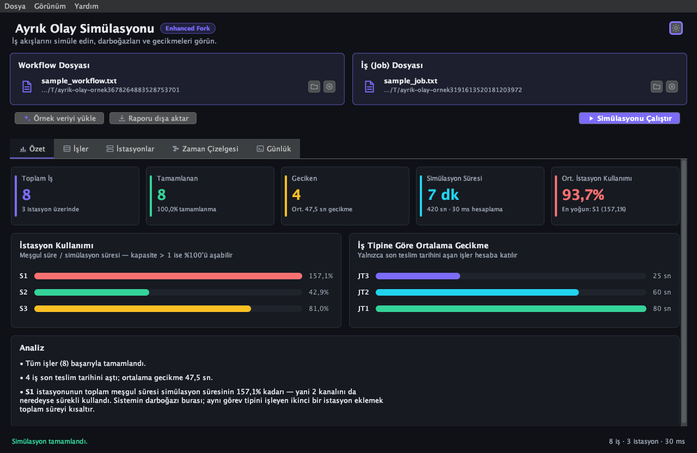
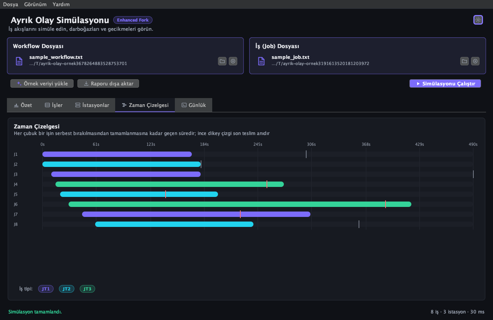
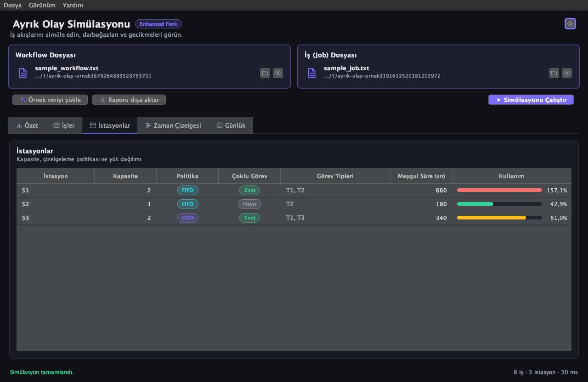
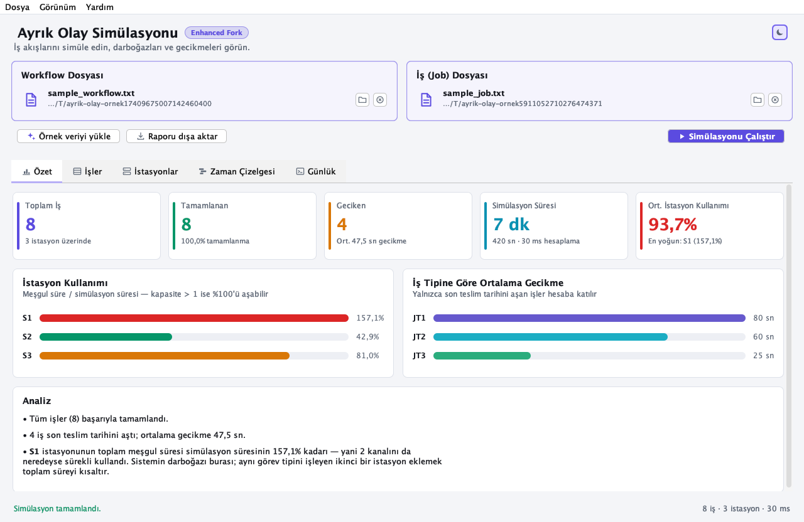

# ayrik-olay-simulasyonu-uygulamasi 🚀

## Bu Fork Hakkında

Bu repo, orijinal **ayrik-olay-simulasyonu-uygulamasi** projesinin kişisel bir fork'udur.

[](https://github.com/TalatKarasakal/ayrik-olay-simulasyonu-uygulamasi/actions/workflows/ci.yml)
[](https://github.com/TalatKarasakal/ayrik-olay-simulasyonu-uygulamasi/releases)

> ⚠️ **Personal Enhanced Fork**
> Bu fork, orijinal ekip projesinin ([sevvalkocc/SE116_Project](https://github.com/sevvalkocc/SE116_Project)) hiçbir dosyasını değiştirmez; tüm geliştirmeler fork sonrasına aittir. Eklenenler: modern build sistemi (Maven), test framework (JUnit 5), CI pipeline ve modern bir grafik arayüz. Simülasyon çekirdeğinin mantığı orijinal ekibe aittir.

## Arayüz 🖥️

Uygulama argümansız çalıştırıldığında grafik arayüzle açılır. İki girdi dosyasını sürükleyip bırakın, simülasyonu çalıştırın ve sonucu beş sekmede inceleyin.



| | |
|---|---|
|  |  |

- **Özet** — Toplam/tamamlanan/geciken iş sayısı, simülasyon süresi ve ortalama istasyon kullanımı; istasyon yükü ile iş tipine göre ortalama gecikme çubukları; darboğazı işaret eden otomatik analiz.
- **İşler** — Sıralanabilir tablo: başlangıç, süre, son teslim, bitiş, gecikme ve durum rozeti.
- **İstasyonlar** — Kapasite, çizelgeleme politikası (FIFO/EDD), çoklu görev bayrağı ve hücre içi kullanım çubuğu.
- **Zaman Çizelgesi** — Her iş için Gantt çubuğu; iş tipine göre renk, son teslim anı için dikey işaret.
- **Günlük** — Simülasyon motorunun ham çıktısı, canlı satır filtresiyle.

Açık/koyu tema desteklenir ve tercih hatırlanır. Sonuçlar metin raporu olarak dışa aktarılabilir; uygulamayla birlikte gelen örnek veri tek tıkla yüklenir.



## Proje Hakkında 📝
**ayrik-olay-simulasyonu-uygulamasi**, karmaşık iş akışlarını ve sistem süreçlerini modellemek için tasarlanmış, Java tabanlı gelişmiş bir **Ayrık Olay Simülasyonu (Discrete Event Simulation)** platformudur. Bu uygulama; iş tiplerini (JobTypes), görevleri (Tasks) ve istasyonları (Stations) dinamik olarak analiz ederek sistem performansını ölçer ve darboğazları tespit eder.

Akademik standartlarda geliştirilen bu proje, endüstriyel mühendislik ve yazılım mimarisi prensiplerini bir araya getirerek gerçek zamanlı sistem davranışlarını simüle eder.

## Öne Çıkan Özellikler ✨
- **Modern Grafik Arayüz**: Sürükle-bırak dosya seçimi, gösterge paneli, sıralanabilir tablolar, Gantt zaman çizelgesi ve açık/koyu tema.
- **Dinamik İş Akışı Yapılandırması**: `Workflow` ve `Job` dosyaları üzerinden esnek sistem tanımlama.
- **Gelişmiş Çizelgeleme Algoritmaları**: İstasyon bazlı **FIFO** (First-In-First-Out) ve **EDD** (Earliest Due Date) önceliklendirme desteği.
- **Çoklu Görev Yönetimi (Multitasking)**: İstasyonlarda aynı anda birden fazla görevin işlenebilmesi için `MultiFlag` desteği.
- **Kapasite ve Hız Modelleme**: İstasyon bazlı hız varyasyonları ve kapasite kısıtlamaları ile gerçekçi modelleme.
- **Detaylı Raporlama**: Simülasyon sonunda ortalama gecikme (Average Tardiness) ve istasyon kullanım oranları (Station Utilization) gibi kritik metriklerin hesaplanması.

## Kullanılan Teknolojiler ve Kütüphaneler 🛠️
- **Dil**: Java 17
- **Build**: Apache Maven 3.x
- **Arayüz**: Java Swing + [FlatLaf](https://www.formdev.com/flatlaf/) (Inter & JetBrains Mono fontları gömülü); ikonlar ve grafikler Java2D ile çizilir, harici görsel varlık yoktur.
- **Test**: JUnit 5 (Jupiter) — 142 test
- **Kapsam**: JaCoCo
- **Mimar**: Nesne Yönelimli Programlama (OOP) ve Olay Tabanlı Mimari
- **I/O**: Java File & Scanner API (Özel dosya ayrıştırma mantığı)
- **Veri Yapıları**: HashMap, ArrayList, Streams API

## Geliştirme Süreci 🤖🤝🧑‍💻
Bu proje, modern yazılım geliştirme metodolojileri çerçevesinde bir **Yapay Zeka (AI) Ajanı** desteğiyle, insan-makine iş birliği (Human-in-the-loop) içerisinde geliştirilmiştir. 
- **Mimari Kararlar**: AI desteği ile optimize edilmiş nesne modelleri tasarlanmış, verimlilik ve genişletilebilirlik ön planda tutulmuştur.
- **Kod Optimizasyonu**: Tip güvenliği, hata yönetimi ve algoritma performansı AI analizi ile iyileştirilmiştir.
- **Dokümantasyon**: Teknik dokümantasyon süreci, profesyonel standartları karşılayacak şekilde AI tarafından yapılandırılmıştır.

## Kurulum ve Çalıştırma Talimatları 🚀

### Gereksinimler
- Java Development Kit (JDK) 17 veya üzeri.
- Apache Maven 3.6 veya üzeri.

### Adımlar
1. Projeyi bilgisayarınıza klonlayın veya indirin.
2. Proje kök dizininde Maven ile derleyin ve paket oluşturun:
   ```bash
   mvn clean package
   ```
3. Uygulamayı çalıştırın.

   **Grafik arayüz** (argümansız):
   ```bash
   java -jar target/ayrik-olay-simulasyonu-1.0.0-enhanced.jar
   ```
   Dosyaları arayüzden seçebilir, ya da baştan verebilirsiniz:
   ```bash
   java -jar target/ayrik-olay-simulasyonu-1.0.0-enhanced.jar --gui <workflow>.txt <job>.txt
   ```
   Elinizde girdi dosyası yoksa **Örnek veriyi yükle** düğmesi jar içindeki örnek workflow ve job dosyalarını yükler.

   **Komut satırı** (iki dosya argümanı):
   ```bash
   java -jar target/ayrik-olay-simulasyonu-1.0.0-enhanced.jar <workflow_dosyasi>.txt <job_dosyasi>.txt
   ```
   *(Her iki modda da dosya sırası fark etmeksizin uygulama otomatik olarak dosya tiplerini algılar.)*

### Testleri Çalıştırma
```bash
mvn test
```

### Kapsam Raporu
```bash
mvn test
# Rapor: target/site/jacoco/index.html
```

---

# ayrik-olay-simulasyonu-uygulamasi 🚀

## About the Project 📝
**ayrik-olay-simulasyonu-uygulamasi** is an advanced Java-based **Discrete Event Simulation (DES)** platform designed to model complex workflows and system processes. This application dynamically analyzes Job Types, Tasks, and Stations to measure system performance and identify bottlenecks.

Developed to academic standards, this project combines industrial engineering principles with software architecture to simulate real-world system behaviors.

## Key Features ✨
- **Modern Graphical Interface**: Drag-and-drop file selection, a metrics dashboard, sortable tables, a Gantt timeline and a light/dark theme.
- **Dynamic Workflow Configuration**: Flexible system definition via `Workflow` and `Job` input files.
- **Advanced Scheduling Algorithms**: Support for Station-based **FIFO** (First-In-First-Out) and **EDD** (Earliest Due Date) prioritization.
- **Multitasking Management**: `MultiFlag` support allows stations to process multiple tasks simultaneously if capacity permits.
- **Capacity and Speed Modeling**: Realistic modeling using station-based speed variations and capacity constraints.
- **Detailed Reporting**: Calculation of critical metrics such as Average Tardiness and Station Utilization upon simulation completion.

## Technologies and Libraries 🛠️
- **Language**: Java 17
- **Build**: Apache Maven 3.x
- **UI**: Java Swing + [FlatLaf](https://www.formdev.com/flatlaf/) with bundled Inter & JetBrains Mono fonts; icons and charts are drawn with Java2D, so there are no external image assets.
- **Testing**: JUnit 5 (Jupiter) — 142 tests
- **Coverage**: JaCoCo
- **Architecture**: Object-Oriented Programming (OOP) & Event-Driven Architecture
- **I/O**: Java File & Scanner API (Custom parsing logic)
- **Data Structures**: HashMap, ArrayList, Streams API

## Development Process 🤖🤝🧑‍💻
This project was developed within the framework of modern software development methodologies, utilizing a **Generative AI Agent** in a human-machine collaboration (Human-in-the-loop) model.
- **Architectural Decisions**: Optimized object models were designed with AI assistance, prioritizing efficiency and extensibility.
- **Code Optimization**: Type safety, error handling, and algorithmic performance were enhanced through AI analysis.
- **Documentation**: The technical documentation process was structured by AI to meet professional industry standards.

## Installation and Execution Instructions 🚀

### Prerequisites
- Java Development Kit (JDK) 17 or later.
- Apache Maven 3.6 or later.

### Steps
1. Clone or download the project to your local machine.
2. Build and package using Maven from the project root:
   ```bash
   mvn clean package
   ```
3. Run the application.

   **Graphical interface** (no arguments):
   ```bash
   java -jar target/ayrik-olay-simulasyonu-1.0.0-enhanced.jar
   ```
   Files can be picked in the window, or supplied up front:
   ```bash
   java -jar target/ayrik-olay-simulasyonu-1.0.0-enhanced.jar --gui <workflow>.txt <job>.txt
   ```
   With no input files at hand, the **Örnek veriyi yükle** button loads the sample workflow and job files bundled in the jar.

   **Command line** (two file arguments):
   ```bash
   java -jar target/ayrik-olay-simulasyonu-1.0.0-enhanced.jar <workflow_file>.txt <job_file>.txt
   ```
   *(In both modes the application automatically detects the file types regardless of the order provided.)*

### Running Tests
```bash
mvn test
```

### Coverage Report
```bash
mvn test
# Report: target/site/jacoco/index.html
```
